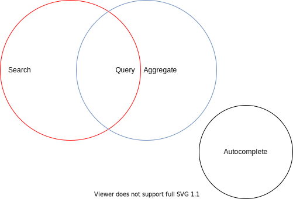
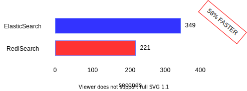

[**Tags**] RediSearch; searchengine;
[**title**] RediSearch Overview, Benchmarks and Creating an Active-Active Search Engine with CRDT
[**speaker**] Kyle; Meir
[**date**] 2019-05-04

Hey everybody, I’m Kyle and Meir will be joining us later to talk about CRDT and some benchmarks stuff, but I want to give you a little overview of RediSearch. So who here has heard of RediSearch before? Raise your hand. Anybody coming to my training on Monday? Well …(0:22) review for you. We’ll be seeing a couple of new things here.

[**SLIDE**] (0:36) 
```
RediSearch can be used for two [primary] things:
Full-text search | Secondary index
```

[**TRANSCRIPT**]

Okay, so let’s take a look at this, so RediSearch can be used for two primary things, right? The first thing it can be used for, is a full-text search and I think that’s what comes to mind when people think of search, right? They think of “Okay I’m gonna search for something in a body of human language, in the body of text” and it can be used for something else though, you know as we developed it for research. We figured out that people were using it for something else, they kind of using it for secondary indexing. So they had data stored somewhere else and they were using it to provide richer interfaces for their existing data that may be stored somewhere else in a way that wasn’t indexable.
So there are two [Inaudible 1.12] primary things we see people using it for, but there are some more use cases built into it. 


[**SLIDE**] (1:28) 



[**TRANSCRIPT**]

One of the things I want to show-- You can see my little laser pointer, right? It can be used for search and aggregation, right? And in the middle of this, I have in this Venn diagram querying. The reason I put it like this, is because they share the kind of same query language and share the same data as well. So there’s another functionality of RediSearch which I’ll go over briefly today which is autocomplete. Autocomplete isn’t-- I think really cool and not very used as much as some of these features but autocomplete does kind of type-ahead. So if you’re typing in a text box and you want to see what would come next, it can suggest it. It is important to know that these circles are not connected here. That is very relevant. The difference here is that they’re not connected because it uses an entirely separate set of data then the rest of this. So searching aggregation-- you can search an aggregator or the same thing, but autocomplete is entirely separate. So when you’re doing this you can use autocomplete with some other-- you know, search solution or some database solution or you know just searching through something that you have there. So to keep that in mind, when I talk about this, that he put something in search, it’s not necessarily gonna be an autocomplete but you can put it there if you want.

[**SLIDE**] (2:29)
```
**Data Lifecycle in RediSearch / Search and Aggregate**
+ Create a schema using four types
	- Text
	- Numeric
	- Tag
	- Geospatial
+ Add Documents in Real-Time
	- Directly
	- From hash
	- Index only
```


[**TRANSCRIPT**]

So with a look like this-- you know, it’s a little bit different than what you usually have in Redis. There’s kind of a life cycle of data in RediSearch. So, the first thing you have to do that’s unusual, is you have to instantiate your schema in RediSearch. You have to go in and say I’m gonna here’s how my data is arranged and we use four primary types of text numeric, geo and tag and we’ll go over those a little bit more in detail later. So after you do this, just give you an overview so you’ll get a more little context. I will go over this now. Text is basically any type of human language, it is designed to work with things that you would say out of your own mouth or things you would read in a book. It is not optimized to be searching through skews or some other code or whatever, that’s not what it’s really designed for. So that’s the text type. It is not a string, right? Like there’s a distinction there. Numeric is numbers, right? And notice all of these don’t have any specific size to them, right? They’re whatever you want. You have tag which is-- the way I like to think about this, is this is a collection of data flags and so if you want to keep me to give you an example you would go to a grocery store and you want to have all the items in a grocery, with say “Is this item vegetarian? Is it vegan? Is it pescetarian? Is it kosher? Is it halal?”. Now one food item could be all five of these things, right? And maybe you have another category, gluten-free or something like that you want to add in. That’d be a great use for tags, right? So you could go and say give me all of that are-- you know-- gluten-free or vegan or whatever like that, so that’s how I like to think about that, it indicates the presence of something. And then geospatial is plotting things on a round world. So in that case-- you know, you can find the distance between points and points and radiuses and it’s actually just like the geo commands in Redis, said it is almost entirely borrowed from that. So you know it only works on a round earth ...(4:49)I’m sorry the map won’t work out for you.
So,--Oops wrong the way. So after you create your schema you have to add documents, right? You can add documents directly from a hash in certain circumstances, you can add it directly or form a hash, so it creates an HSET with your hash object, the hash map. And then the other interesting thing that I like to point out is that you can add documents without storing them. In that way you’re only indexing the document. So instead of returning back a document that has fields and values, it would just give you a document ID, okay? So you create your schema and then you can add documents, and it’s you can add documents in real-time, so at any point you can add documents, so this order is not exactly sequential. After you have documents you can search and aggregate on those documents, and at any point, you can add more documents. Then you can delete documents as needed, so you can delete documents at any point and it doesn’t affect re-indexing or anything like that, it’s very efficient to do so. At any point, you can drop the whole index as well and just say I’m done with this index, and let’s move on. 

So let’s take a look, kinda little bit of overview on the query language. So search engines are different from relational databases in that query language does not require a knowledge of the structure of the data, right? So you can be very freeform with it. So imagine that you have a list of used cars, right? And you want to find some used car, and you can-- so you would expose maybe directly to your end-user


[**SLIDE**] (5:55)
```
Query Language
+ Goals
	- Intentionally not SQL
	- But familiar
	- Exposable to end-users
+ Simple
	- No knowledge of data / structure needed
+ Powerful
	- With knowledge, zero in on data
```

[**TRANSCRIPT**]

And you can give a query lang like a query that is very simple like this. Oh shoot, I want to go over a couple of things. I went over some of these. We’re not intentionally sequels, like the reason it’s not a sequel is people get itchy and they write full page queries and sequels like it’s different, right? The other thing, is that it’s familiar enough that you can probably look at it and go, okay I’ve done something similar in the past and exposable to end-users. There’s no management functions, you can’t drop indexes or do anything from this, this is only for finding documents. You can’t add documents or anything like this. It needs to be simple enough where no knowledge is required, but an easy powerful enough to kind of go deep and find anything that you want in the data.

[**SLIDE**] (6:37)
```
Query Syntax
Ford Truck
```

[**TRANSCRIPT**]

So here’s the query I wanted to talk to you about. So you have this list of cars that you’re trying to find. This is a completely valid RediSearch query for truck that would find (inaudible 6:45) ford trucks. But it goes way beyond that. 

[**SLIDE**] (6:54)
```
Query Syntax - more advanced
AND / OR / NOT / Exact Phrase / Geospatial /
Tags / Prefix / Number Ranges / Optional Terms
& more
And combine them all into one query:
(chev*|ford) -explorer ~truck @year:[2001
2011] @location:[74 40 100 km] @condition:{
Good | very good }
```

[**TRANSCRIPT**]

So let’s take a look at some of the things. We have-- you know, and, or, not are the kind of-- you know, operations you would expect, exact phrase, matching, geospatial, tags, we talked about prefix searching, number ranges, optional terms, and more. Let’s go over those in the example, because those are abstract, and don't mean a lot. So if you have this, we’re getting more looking at used cars, we’re gonna look for Chev and this is an asterix here which would indicate a prefix search and that would find Chevy, or Chevrolet, or Chev X, or something like that. And then we have this pipe character, and this pipe character represents “or”, so, ford. The parents are for groupings, so this needs to find prefix Chev or Ford, so that is one pairing. We have a negative option, so we don’t want to find an explorer, if an explorer is present in the documents, we will exclude it from search. We have this tilde, which is optional, I think that’s one of the more interesting ones. Optional says “hey if a truck is present, that’s good, boosted in its rankings,” right? So it’ll appear higher in the search result than the equal one that doesn’t contain it. Then we’re gonna go into a field based search. So in this case we have a field called “year”, you probably know what that represents. We’re gonna search between 2001 and 2011 and that would be inclusive. Then we’re gonna do a geospatial, so location and we’d use long lat, and then the radius. So in this case we’re finding 74 x 40 within a 100 kilometer radius. So that would find it within the-- I think that’s around New York City. And then we’re doing our optional or our tags, so the condition is saying good or very good in that case. So that’s a pretty deep query you can keep on iterating on and find more and more things.


[**SLIDE**] (8:39)
```
Full-text Search
+ Stop words:
	- “A fox in the woods” → “fox woods”
+ Stemming:
	- Query “going” → find “going” “go” “gone
+ Slop:
	- Query: “glass pitcher”, slop 2 → “glass beer pitcher”
Matched text highlight/summary:
	- Query: “To be or not to be” → Hamlet. <b>To be, or not to be<b>-that is the question
```

[**TRANSCRIPT**]

So from an example of what full-text search is, there’s a few things that you need to keep in mind. We do a bit of pre-processing to the documents and the search queries. So if you’re familiar with the term stop words, this eliminates things from the both query and from the document that are so frequent in text that they are useless, and I’m using English examples, RediSearch can support many languages in a couple different ways and you can specify your own and all that stuff. But in this case you have, maybe a document as “a fox in the woods”, RediSearch will look at that and say “a” and “in the” are so frequent in the corpus, that we no longer need them, so there are stop words where they are removed. Then we’re going to look at stemming. So effectively with stemming what you’re doing is you’re finding like the root word, it’s not exactly the root word from a linguistic point of view, but it finds a deterministic way of shortening a word, based on a language that it’s interpreted in. So “going” would also match “going” obviously, but “go” and “gone” as well. Then we look at slop, slop is one of the weird things, I love the naming of it, I don’t think this is exactly in this industry term, it’s not used in all search engines, but in this case it’s saying “hey let's jump over a couple of words”. So we want to find a glass beer, a glass pitcher, and we indicated a slop of two and we’re gonna say “let’s actually hop over that”, so “glass pitcher” would match “glass gallon beer pitcher”, so there’s two intervening words here. Then we’ll look at with or without the content. So if you had all of Shakespeare’s works and you searched to be or not to be, do you want to return all of hamlet? You probably don’t. So in that case we would just say let’s just get the ID so that would be hamlet, and then if you want to find more maybe that’s not enough, you want to see the passage in which that’s in, there’s two features we have: highlighting and summary. In this case we would go say okay to be or not to be as our query and then highlighting is gonna put in some tags, these are HTML tags. You can specify it to be anything you want to, but we’re using a B tag here, it just surrounds the phrase or the matched phrase, so it’s surrounding that and notice that it’s also skipping over any like comments or commas, or punctuation, and it’s getting kind of a fragment around it and that’s what we call our summarization feature.


[**SLIDE**] (10:55)
```
Full-text Search
+ Synonyms
	- Query “Bob” → Find documents with “Robert”
+ Query Spell Check
	- “A fxo in the woods” → Did you mean “a fox in the woods”
+ Phonetic Search
	- “John Smith” → “Jon Smyth”
```

[**TRANSCRIPT**]

So more things about full-text search: synonyms. You can specify synonyms, so you’d find-- if you put it for “Bob” you’d find “Robert” as an example, you specify your own and before that you can take a look at it. Then we have spell check and that will do a levenshtein distance of one. So if you went in and said ”a fxo in the woods” it would say “did you mean “a fox in the woods”?”, that sort of use case. And finally Phonetic search, the next searches are really things that people get excited about, but I want to warn you that it's really dangerous, I say this to everybody because they think this is the best thing in the world, but it is very useful in certain circumstances but not in all circumstances. In this case, Jon Smyth, doesn’t actually represent a character John Smith over here but they sound the same. So it uses-- it decomposes the words into a phonetic representation. That’s great if all your documents are in the same language. If you have documents that are in multiple languages and you try to do phonemic search, everything goes crazy. So I’ll give you the example of a phonetic problem. I live in Canada and if I type in Toronto it will also match the city trent, they don’t look anything alike. But Toronto is a native American term, it doesn’t follow English Language patterns, so it actually gets decomposed into trent. It would be TR NT, I think, this Redis decomposes it into. So if you have something that’s very consistent, it’s great. If you’re using stuff like place names, you know, Milwaukee, Kentucky, these things don’t actually follow English language words. So be careful with that but it is useful in a lot of situations. So once you’ve something maybe you want to go in and actually sort the values in the returned documents.

[**SLIDE**] (12:31)
```
Scoring, Weight, and Sorting
+ Each field can have a weight which influences the rank in the returned result
+ Each document can have a score to influence rank
+ Built-in Scoring Functions
	- Default: TD-IDF / term frequency-invese document frequency
	- Variant: DOCNORM
	- Variant: BM25
	- DISMAX (Solr’s default)
	- DOCSCORE
	- HAMMING for binary payloads
+ Fields can be independently sortable, which trumps any in-built scorer
```

[**TRANSCRIPT**]

So each field can have what’s called a weight, this actually influences the importance of the fields in the document and where it is returned. So a higher weighted thing would be returned higher if there is a match for that. Then each document itself can have a score and that represents the overall quality of it, so if you have a document it’ll represents between zero and a one number, so if you have for example a document with a score of one that’s a very strong indication that it is a quality document, if it has a point zero one it is a very low quality document and it will influence how everything is ranked in its conditions. Then we have a few built in scoring functions by default. We use TF-IDF term frequency- inverse document frequency which is a fascinating algorithm, I suggest if you don’t know much about it, take some reads on it, it's really nice. Take some time on Saturday night and read about this algorithm, I did, I was surprised at how much I acquired from this. And there’s some variants, we have DOCNORM which was normalized as the document scores but it then does TF-IDF on it. Then BM25, which is another variant. There’s DISMAX, if you’re using solr that’s what they use as default, it’s a different ranking algorithm. And then you can look at raw DOCSCORE and HAMMING distance and we have this concept of binary payloads. I don’t know anybody who uses this, I’d love to see a use case for it, but you can do other things too. You can define your own scoring functions as well, so there’s a lot of options here.


[**SLIDE**] (14:12)
```
Aggregations
+ Processes and transforms
+ Same query language as search
+ Can group, sort and apply transformations
+ Follows pipeline of compostable actions:
[Follow] --> [Group] --> [Apply] --> [Sort] --> [Apply]
                        |_ [Reduce]

```

[**TRANSCRIPT**]

So I want to go over aggregations, so not only you can find documents, you can also aggregate. So in this case let’s take a look at aggregations, basically the process and transfor, it uses the same query language as the rest of RediSearch, and you can group, sort, apply, and transform to create the right pipeline. So you can follow these composible actions, this is an example, I show this because it does apply a transformation twice and you can do reductions as well. It’ll make more sense later on as I go through an example.


[**SLIDE**] (14:39)
```
Grouping and Applications        
+ Reducers:
	- COUNT
	- COUNT_DISTINCT
	- COUNT_DISTINCTISH
	- SUM
	- MIN
	- MAX
	- AVG
	- STDDEV
	- QUANTILE
	- TOLIST
	- FIRST_VALUE
	- RANDOM_SAMPLE
+ Manipulate:
	- Strings
	- substr(upper(‘hello world’).0.3 -> “HEL”
	- Numbers w/ Arithmetic
	-  sqrt(log(foo) * floor (@bar/baz)) + (3^@qaz % 6)
	- Timestamp to Calendar
	- Timefmt (@mystimestamp. “%b %d %Y %H : %M : %S” ) -> Feb 24 2018     00:05:48
```

[**TRANSCRIPT**]

So in this we’ll look at all of our reducers. This is-- some of these look pretty familiar, my favourite is count_distinctish which trades off some performance for accuracy, so it’s a lot faster to use probabilistic data structures internally, but you can see you’re doing counts and the normal things. You can manipulate strings internally, so you can actually create an expression to do all sorts of things that you might be used to, and they have this little expression language, you can do arithmetic in the same way on numeric fields, and then we actually understand time, which is kind of the first place in Redis that understands time, it takes a unix timestamp and you can format it and get outputs out of it. So, pretty interesting stuff.

[**SLIDE**] (15:31)
```
Autocomplete/Suggestions
+ In the module, but separate storage
+ Radix trie-based, optimized for real-time, as-you-type completions
+ Simple API
	- Add a suggestion (FT.SUGADD)
	- Get a suggestion (FT.SUGGET)

                                                        [ r ]
                                                       /     \
                                                 [om]      [ub]
                                                 /    |         |      \
                                      [ulus]    [an]     [e]        [ic]
                                     /            /   |        |    \       |   \   
                                 [3]         [e]  [us]   [ns]  [r]   [on]  [undus]
 	 		          /        |        |      |      |          |
                                           [1]       [2]     [4]   [5]   [6]      [7]
	1. Romane
	2. Romanus
	3. Romulus
	4. Rubens
	5. Ruber
	6. Rubicon
	7. Rubicundus
```

[**TRANSCRIPT**]

Then we have autocomplete, I do want to spend a couple minutes on that. Shoot, I don’t have my example in here, I can probably bring it up for you. But with autocomplete I’ll do this and then we’ll go back to the example, I’ll pull it up for you. So, it’s separate, like I just talked about before, based on Radix-trie, it’s real time as you type completions. This is something I just pulled from wikipedia, it just gives an example of radix-trie, but it’s really illustrative of what happens, when you type something it’ll say-- you know you start with something it’s basically a prefix and then you go down and the computational complexity of this tree is very low, so you can get really fast results back. It has a very very simple API, you're gonna do FTSUGADD, which means I’m gonna add a suggestion in, so in that case you would say “hey, I want to add suggesting in”, and you typed Kyle and add that in as a suggestion, and then when someone types K later on it, it would say it returned kyle if it got K as that prefix. You can get a suggestion that’s how you get that prefix out of it and then you can delete it. Now there’s a cool thing you can do with this, you have the ability to actually go in and increment the suggestions which actually is a really cool pattern, so you can create a self-improving autocomplete. So you can take an example of you’re having an autocomplete and then when you define some sort of success metric, somebody clicks on a link or something like that, you say at that point that’s successful, and then you would increment the score of it and it would be more likely to be returned higher in the rankings. It’s a little bit abstract of a concept, I would suggest you, go there’s a webinar that I did a few months ago, go to our website Redislams.com and go to the past webinars, there’s a really good webinar that I did and it’s a full 20 minutes on that pattern. 
So that’s where the score comes into it.

[**SLIDE**] (17:24)
```
RediSearch in Action: FT.AGGREGATE

FT.AGGREGATE shipments “@box_area:[300 +inf]”
	APPLY “year(@shipment_timestamp / 1000)” AS shipment_year
	GROUPBY 1 @shipment_year REDUCE COUNT 0 AS shipment_count
	SORTBY 2 @shipment_count DESC
	LIMIT 0 3
	APPLY “format(\”%sk+ Shipments\”, floor(@shipment_count) / 1000)) AS shipment_count
```

[**TRANSCRIPT**]

Okay, I want to quickly bring something up, apologies for switching and then Meir will take over in just a moment. So I want to show you, I missed a slide here when I crafted this. So this is an aggregation example and this is a very kind of end to end example of how aggregations work, but also we can show the query. So we’re gonna start here. FT.AGGREGATE is the command, what if I was to change it to FT.SEARCH this would be a completely valid search. So in this case I’m looking for box area which is a numeric between 300 and positive infinity, so 300 and above, right? Let’s add something to this. So that’s not returned all of the boxes that have a total area of 300 or above, and that’s just what I’ve stored in my document before. So I wanna apply something here, so I’m gonna go in and say I have a shipment time stamp, right? Let’s say that’s a second precision timestamp instead of-- or a millisecond precision timestamp instead of a second precision. So I’m gonna go and divide that by a thousand and then apply the year filter and I’m going to store that as a shipment year, right? So in that case you would be, you know you had at some timestamp it would then come out as 2019, useful. I’m gonna group that by shipment year, so I’m group by and there’s a pattern here that’s common, the what RediSearch uses is a kind of prefix notation. So this one means I have one argument coming related to this. So one thing, so grouping by shipment year, then I’m gonna reduce and count has zero arguments as shipment counts. So that’s gonna say in the shipment year, how many 2019 are there, right? I’m gonna sort that by a shipment count and that has two arguments shipment count and that’s in descending order. So in that case, I'm gonna say okay 2019, 18, 17, and so on and so forth. I’m gonna limit it to effort--it just a few items and then when I apply a transformation that’s kind of complicated here. So I’m taking the shipments as you can see I can sub this in with kind of pearl-like syntax, so I’m taking the floor of the shipment count dividing it by thousand, so I want to say like 10k shipment, right? That sort of thing, that’s where this K+ comes from. Some just saying 10,000 or more shipments and that’s that. So you can see how you can create this whole pipeline of aggregations here. So at that point I’m gonna hand it over to Meir and he’s gonna go over CRDTs and how they affect search and a benchmark as well. Great, okay, so we’re gonna switch laptops just a moment.

[**SLIDE**] (20:12)
```
Agenda:
1. RediSearch Benchmark
2. What is CRDT?
3. Search & CRDT
```

[**TRANSCRIPT**]

So thank you Kyle, my name is Meir and I’m one of the maintainers of RediSearch. Mark is here with me, Mark there is the--also one of the maintainers of RediSearch together. Well, developing RediSearch and today I wanna talk to you about two things, one is the-- to show you a RediSearch benchmark that we did recently, and the second is how RediSearch and CRDT can cooperate in order to achieve an active-active search engine. So let’s get started.
So as I said we will start with some benchmark that we did recently then we will talk a little about CRDT and what CRDT are, and then we will talk how search and CRDT can cooperate and we will see a cool demo of how it’s working.


[**SLIDE**] (20:30)
```
Use case 1:
Building in an index
and Running a Simple Query
```

[**TRANSCRIPT**]

So, first we will start with benchmark. So, recently we did a benchmark of RediSearch compared to ElasticSearch and the first use case we compared two things. The first thing we compare, is building the index, how much time it takes us to build the index, and the second, is the query, how much time you take to a query to run on the index.


[**SLIDE**] (20:58)
```
Dataset
+ Indexing of a wikipedia dataset: 5.6 docs @5GB
+ Date of dump: Feb 7. 2019
```

[**TRANSCRIPT**]

So we took a WIkipedia and wikipedia data set, it contains 5.6 million docs and it’s around 5 gig. 


[**SLIDE**] (21:09)

**RediSearch vs ElasticSearch : indexing time**



[**TRANSCRIPT**]

And we got those research. So indexing, RediSearch indexes all the data in around 200 seconds compared to ElasticSearch that indexes the data in around 350 seconds, so RediSearch is around 58% faster.

[**SLIDE**] (21:36)
```
RediSearch vs ElasticSearch - search of two words
Diagram, gimana nulisnya?
```

[**TRANSCRIPT**]

And then we compared the searching, the query, actually querying data and get results. So regarding throughput, RediSearch was-- could have gotten like 12,000 ops/second compared to ElasticSearch that could’ve done like 3,000, and the latency was almost the same, so RediSearch can do like four times faster than ElasticSearch regarding query time.

[**SLIDE**] (22:08)
```
Use case 2
A Multi-Tenant Search
```

[**TRANSCRIPT**]

The second use case that we did is called-- we call it Multi-Tenant. So for example that we want to create many many indexes, like we have a many many clients, each client has a shop and each client wants to search for stuff only in the shop, only stuff that exists in the shop. So in this case you need to create an index for each of your clients and this is what we call a multi-tenant search. 

[**SLIDE**] (22:40)
```
What is a multi-tenant search?
+ Serving a multi-tenant application
+ Each tenant has its own dedicated and isolated search index
+ Number of docs per index - 500
+ Total number of tenants - 50k
+ Total number of indexed documents - 25M
```

[**TRANSCRIPT**]

So what we did is we created 50,000 indexes with 500 documents in each index, total of 25 million documents.

[**SLIDE**] (22:53)
```
Multi-tenant Results
Diagram, gimana nulisnya?
```

[**TRANSCRIPT**]

The result is that RediSearch could’ve indexed all these data, create all those indexes in 3 minutes and 21 seconds, and Elastic couldn’t do it.

[**SLIDE**] (23:06)
```
Multi-tenant Results
+ Natively in memory (*ElasticSearch was running with cache enabled)
+ C (RediSearch) vs, Java (ElasticSearch)
+ Extremely optimized built from the ground-up search engine vs, less optimized 20yro Lucene search engine
+ Redis RESP light protocol vs ElasticSearch HTTP based protocol
```

[**TRANSCRIPT**]

So we believe that the comparison and the differences is because: First, RediSearch is written in C, and Elastic written in Java, second, RediSearch is extremely optimized, it’s built from the ground to be as fast as possible compared to ElasticSearch which is using the machine behind the scene and it’s like different components, and you know that when you split stuff you might better object oriented, programming, or technique, but you probably will lose performance. So RediSearch was built in order to be as fast as possible. And the last thing that we find, that head of all in those results, is Redis uses a very light-weighted protocol compared to Elastic that uses HTTP protocol. So this probably provides better better better results.

[**SLIDE**] (24:21)
```
Setup
+ Client & Server - AWS c4.8xlarge (36 vCPU and 60GB RAM)
Diagram, gimana nulisnya?
```
[**TRANSCRIPT**]

So those are the machines that were used to compare to do the benchmark.

[**SLIDE**] (24:27)
```
Configuration Settings
Elasticsearch:
+ Shards: 5
+ JVM settings (Xms and Xmx)
+ Indices.memory.index_buffer_size
+ Index.refresh_interval (triggers flushes)
+ Index.number_of_replicas
RediSearch:
+ Doc table size 10M
+ No threads concurrency (handle using enterprise cluster)
```

[**TRANSCRIPT**]

I’m gonna skip this, and anyone has any questions regarding this benchmark maybe?

To the question you have the benchmark results, so in ElasticSearch you have different kind of structures like parent-child relationship and different ways, you can store the data model. So those when you actually write complex queries the performance on ElasticSearches…(24:3). So do you have, so it’s the benchmark considering the different modules? Or is it-- yeah.

So in this benchmark we just compare a simple search result. I think you would look for Barack  Obama or something very simple we didn’t test, like complex or aggregation query, but we will do it in the future.

[**SLIDE**] (25:18)
```
Multi-site Active-Active Replication

Consensus based Replication
	A single instance needs to know that a majority of parties on an operation before applying it 
	+ Advantage: 
		- Secured strong consistency
		- Known algorithms Paxos, Raft…
	+ Disadvantage:
		- Take time to reach an agreement (especially on a worldwide scale)
```

[**TRANSCRIPT**]

So I will continue with CRDT, and first, before we start to talk about CRDTs and RediSearch, let’s talk about what CRDT is. Before talking about CRDT let’s talk about active-active replication. The main or the usual way that we do-- not way, but-- we used to do replication before CRDTs is we needed to achieve consensus between all the instances in the cluster. So for example here, consensus gives us the stone consistency property which means that all the replicas will see all the operations at the same order. This is a very stone consistency, it is a stone property, and it gives a very good-- in fact it shows you that your data is the same on all the instances participating in the protocol, but it costs, it costs because you need to know that at least a majority of instances have agreed on operations before you can apply it, and this takes time, especially on a worldwide scale.

[**SLIDE**] (26:44)
```
What is CRDT
Conflict Free Replicated Data-Types
+ Consensus free technique that satisfy the “Eventual Consistency” properties
	- No need to coordinate with other parties in advance --> increases performance
	- Waiting long enough, all parties state will be aligned --> strong eventual consistency

INCRBY 5 --> Sync --> x=2 <-- Sync <-- DECRBY 3
```

[**TRANSCRIPT**]

Now what CRDT provides? It provides a different property that calls the eventual consistency property. The eventual consistency property promise us did if we wait long enough, I mean like submillisecond laters a lot like seconds or hours, then all the data on all the instances will sync and we will see the same data on all the instances. Now keep in mind that it doesn’t surely mean that all the replicas, all the instances will see the same operations at the same order. They might apply the operation a different order, but the results are the same. So here for example, I have two instances, one is performing INCRBY 5 and the other is performing DECRBY 3. So after syncing the results is two, because if I’m increasing by 5 and then decreasing by 3, I get 2, and on the other hand if I’m decreasing first by 5 and then increasing-- sorry, decreasing first by 3 and then increasing by 5, then the result is also 2. So it doesn’t matter at which order I apply those operations, I get the same results, and this is the eventual consistency property. Any questions regarding this? Because this is important to understand once we move to-- okay, good.

[**SLIDE**] (28:22)
```
RediSearch & CRDT
RediSearch and CRDB (Redis CRDT) --> a Multi-site Active-Active search engine
+ RediSearch (FT.ADD) saves the raw data as a Hash.
+ CRDT replicates the Hash between the sites.
+ On Hash received, CRDT notifies RediSearch causing new data reindex.
+ Only after conflicts being resolved by CRDT, RediSearch is being notified.

Ft.add idx doc name Danny --> [site 1] RediSearch <-- hset doc1 name Danny --> CRDT
[site 2] RediSearch <-- notification on new data arrived --> CRDT
Site 1 <--  replicating data to the other replica --> Site 2
Diagram, gimana nulisnya?
```

[**TRANSCRIPT**]

So how CRDT & RediSearch can cooperate in order to achieve an active-active search engine? So this is how it’s happened and-- Okay, so when you do an FT.ADD command you want to add the data to your index. The data is index on the replica on which you do the FT.ADD and then it’s written into a hash. Once it’s written into a hash then the CRDT knows how to replicate this hash to the other replica, the data is replicated too. For example, here’s site 2, and then once the data is replicated and all the conflicts are solved by the CRDT engine then the CRDT notifies the RediSearch on site 2 that the new data has arrived and it needs to be indexed, then RediSearch indexes this data on site 2 and when you do a search, a query, on both replicas you’ll get the same results.

[DEMO] (29:19)

[**TRANSCRIPT**]

Okay, so we will see a demo on how it’s working. So what we have here is this, at the lower we see the connection between replica 1 and replica 2, on the left side we see replica 1, on the right side we see replica 2. So let’s start it. As I said this will be replica 1 and this is replica 2. Now what we’re gonna do first is we’re gonna do an FT.ADD command on replica 1, we’re gonna add the data on replica 1 and we’re gonna search for this data on replica 2. We’re adding the-- on field test we’ll add the name Hana, let’s do it. So we got an OK reply and you can immediately see that the data was replicated from replica 1 to replica 2. And now when we search for it we will get Hana on replica 2. Let’s do it the other way around, let’s add data on replica 2 and search for it on replica 1. So we add Danny, we got an OK reply, we see that the value was replicated and then when we search for it on replica 1, we find it. Let’s now make it a little bit complicated and instead of adding data we will update an existing data, so what we’re doing here we’re updating document 2 and we’re changing the field test to Peter. So let’s do it. We got an OK reply and we see that Peter was replicated. So let’s search for Peter on replica 2 and we see that we can find it. Now the last thing we’re gonna do is we’re gonna complicated even more. We’re gonna update document 2 on the two replicas at the same time and we’re gonna break the connection during the update. So we’ll actually cause a CRDT conflict. So let’s stop the connection. Okay. And now we’re gonna update, we’re gonna update replica 2 first 
With the value Michelle and replica 1 second with the value of Jim. Now if we search for Jim on replica 1 we will find it and if we search for Michelle on replica 2 we will also find it. But they’re not synced, right? Because the connection is broken, they couldn’t, they cannot sync. So let’s return the connection and we can see immediately the value was propagating between the replicas and now if we search on both replicas for Jim, we can find it. And this is how CRDT and search can work together and give you an active-active search engine.

